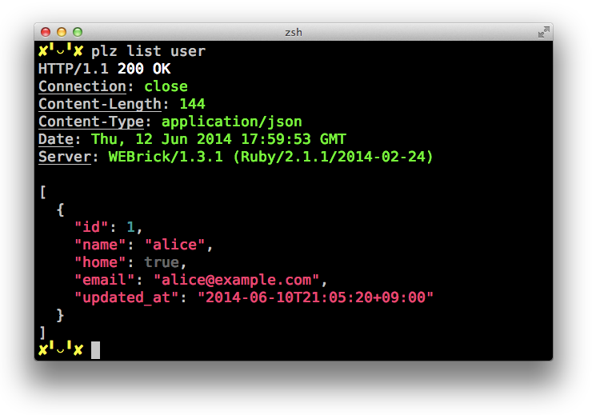

# Plz
JSON Schema based command line HTTP client.



### Install
```sh
$ gem install plz
```

### Synopsis
```sh
$ plz <action> <target> [headers|params] [options]
         |        |         |      |       |
         |        |         |      |       `-- --no-response-header
         |        |         |      |           --no-response-body
         |        |         |      |           --no-color
         |        |         |      |           --help, -h
         |        |         |      |
         |        |         |      `---------- key=value or key:=value
         |        |         |
         |        |         `----------------- Key:value
         |        |
         |        `--------------------------- target name
         |
         `------------------------------------ action name
```

### Schema
To use Plz, you need to have a JSON Schema file at `./schema.json` or `./schema.yaml`,
that describes about the API where you want to send HTTP request.
Plz interprets command-line arguments based on that JSON Schema, then sends HTTP request.
See [schema.yml](schema.yml) as an example.

### Headers
To set custom request headers you can use `Key:value` syntax in command line argument.

```sh
$ plz list user Api-Access-Token:123
```

### Params
Params are used for the following purpose:

* URI Template variables
* Query string in GET method
* Request body in other methods

You can set params by `key=value` or `key:=value` syntax in command line argument.
`key=value` is parsed into String value,
while `key:=value` is parsed into JSON value (e.g. key:=17 will be `{"key":17}`).

```sh
$ plz create user name=alice age:=17
```

### Example
```sh
# GET /users
$ plz list user
[
  {
    "id": 1,
    "name": "alice"
  },
  {
    "id": 2,
    "name": "bob"
  }
]

# GET /users/2
$ plz show user id=2
{
  "id": 2,
  "name": "bob"
}

# POST /users with {"name":"charlie"} params
$ plz create user name=charlie
{
  "id": 3,
  "name": "charlie"
}

# POST /users with {"name":"dave",age:20} params
$ plz create user name=dave age:=20
{
  "id": 4,
  "age":20
  "name": "dave"
}

# POST /users with Api-Access-Token:123 header and {"name":"ellen"} params
$ plz create user name=ellen Api-Access-Token:123
{
  "id": 5,
  "name": "ellen"
}
```
